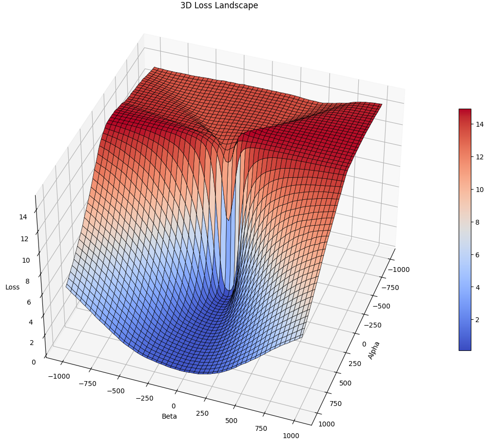
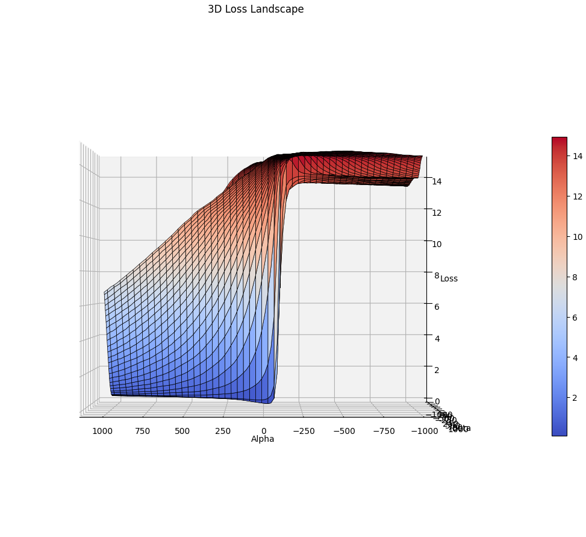

# Loss Landscape Visualization

## Introduction

This project visualizes the loss landscape of a simple neural network trained on the MNIST dataset. By exploring the loss landscape, we gain insights into the optimization process and the geometry of the loss function around the trained parameters.

## Methodology

We follow the approach described in [Li et al., 2018](https://arxiv.org/abs/1712.09913), involving:

1. **Training the Neural Network**
2. **Selecting Direction Vectors**
3. **Parameter Space Projection**
4. **Loss Computation**
5. **Visualization**

## Neural Network Architecture

- **Input Layer**: `[28, 28, 1]` grayscale images.
- **Rescaling Layer**: Normalizes pixel values.
- **Flatten Layer**: Flattens the input.
- **Dense Layer**: 128 units with ReLU activation.
- **Output Layer**: 10 units with softmax activation.

## Steps

### 1. Training the Neural Network

We train the model on the MNIST training set and save:

- **Initial Parameters**: $\theta_0$
- **Trained Parameters**: $\theta^*$

### 2. Selecting Direction Vectors

- **$d_1$**: Difference between trained and initial parameters:

  $$
  d_1 = \theta^* - \theta_0
  $$

- **$d_2$**: Random vector orthogonal to $d_1$, obtained via Gram-Schmidt orthogonalization.

### 3. Parameter Space Projection

We define new parameters:

$$
\theta = \theta^* + \alpha d_1 + \beta d_2
$$

where $\alpha$ and $\beta$ are scaling factors.

### 4. Loss Computation

For each $(\alpha, \beta)$ in a grid, we:

1. Compute $\theta$.
2. Update the model with $\theta$.
3. Compute the loss on the validation set.

### 5. Visualization

We plot the loss values over the $(\alpha, \beta)$ grid to visualize the loss landscape.

